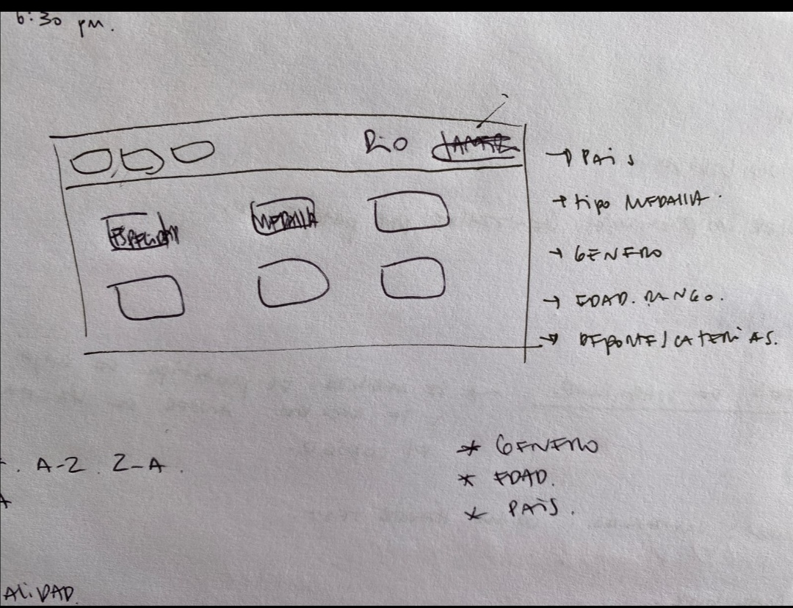
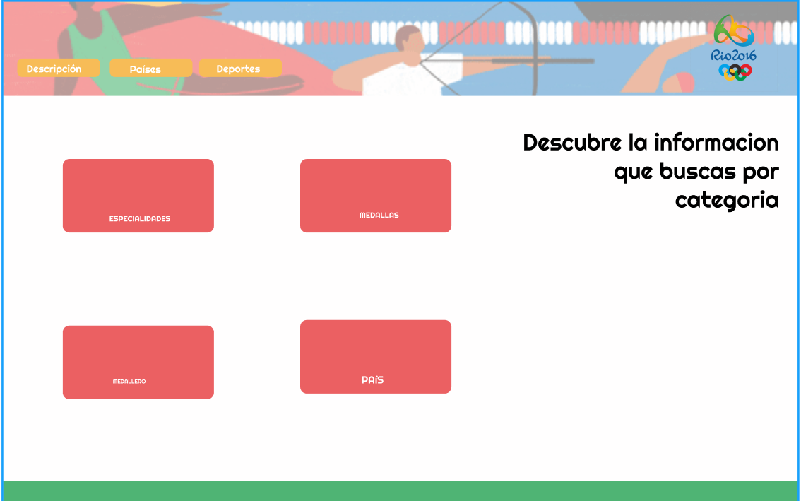
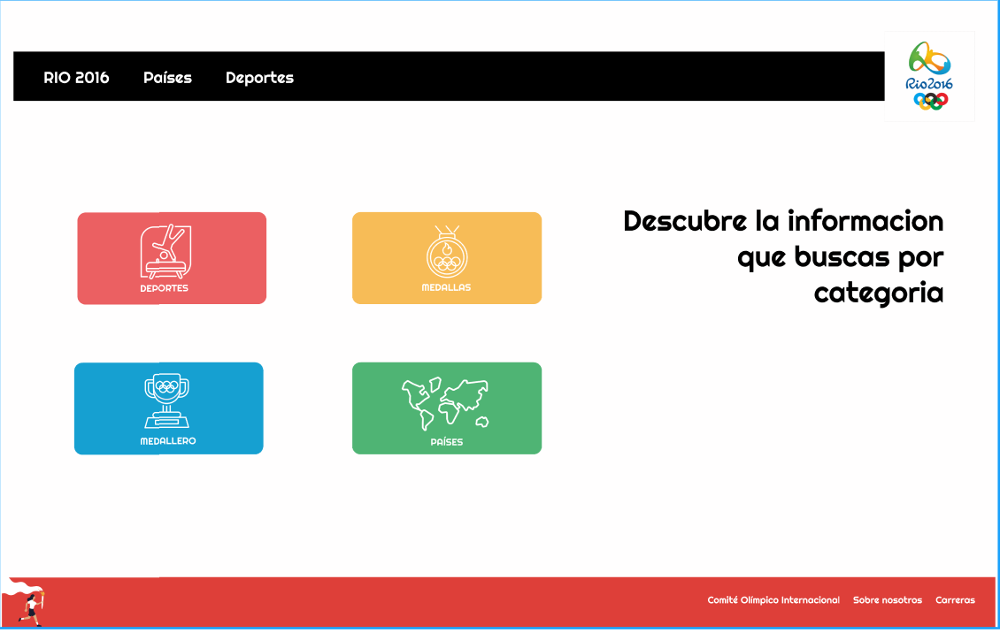
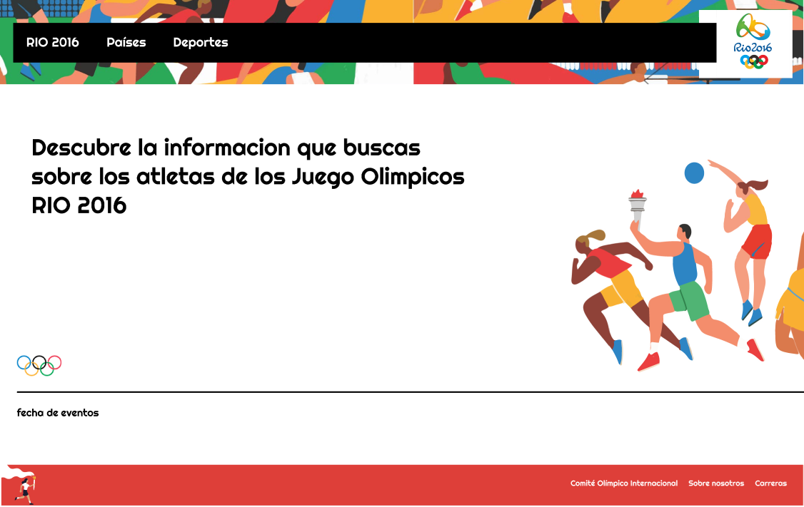
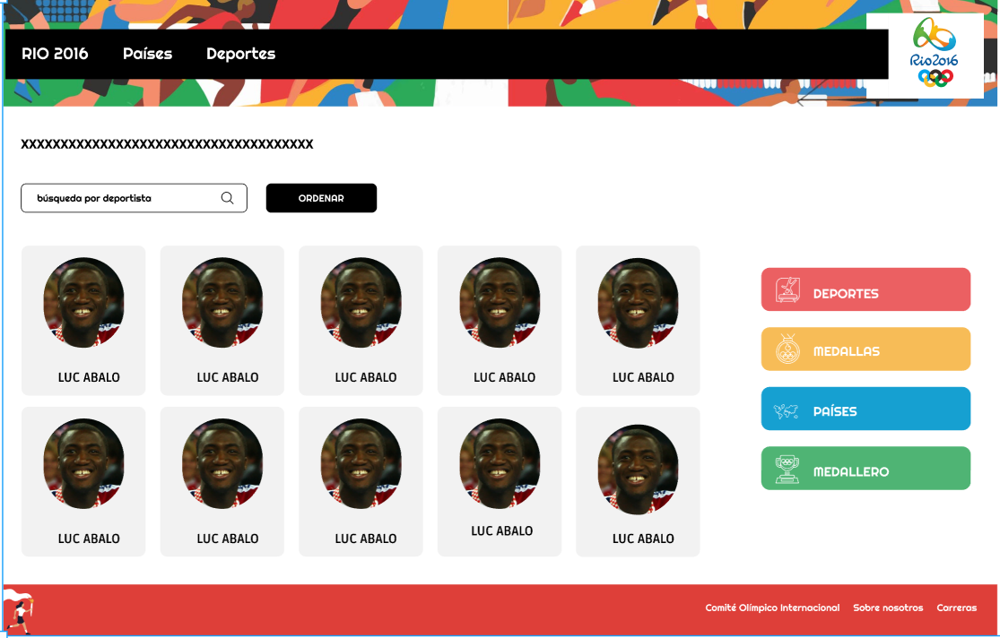
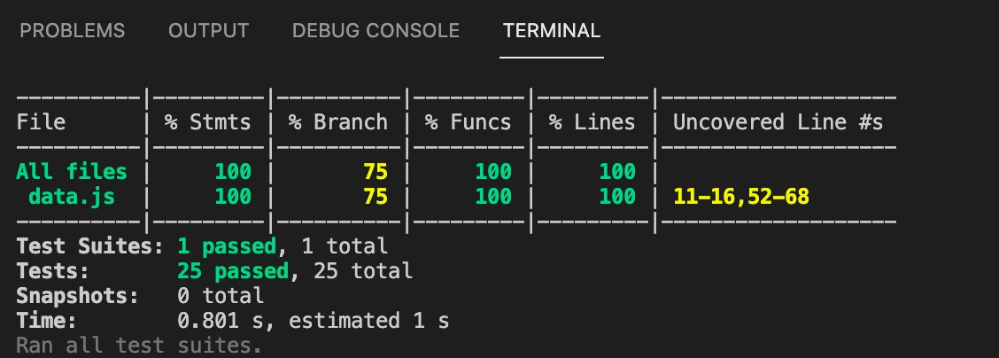

# Proyecto Data Lover - Juegos Olímpicos de Río de Janeiro 2.016 / Aylin Zúñiga - Norkis Rivero

En este proyecto construimos una página web que permite visualizar a los atletas que participaron en las olimpiadas de Río 2.016, y cómo destacaron en ella. La página está dirigida a usuarios que son seguidores de los Juegos Olímpicos y quieran conocer quiénes fueron los atletas destacados de esta edición (Río 2016); igualmente, permite realizar búsqueda por nombre, ordenar de la A-Z y Z-A; y filtrar por medallas, género, team y sport. Está dirigida a usuarios entre 18 y 45 años o más.

Para la obtención de las historias de usuarios, se implementó un cuestionario vía google, el cuál nos arrojó la información necesaria para el diseño de nuestra página web.  

# Historias de usuario

1. Como admirador de los Juegos Olímpicos, quiero visualizar a los atletas de Río de Janeiro 2016, para saber quiénes particparon en dicho evento.

Criterios de aceptación:

- La página debe ser responsive.
- Colores similares a los del logo de Río 2016.
- Se deben visualizar los atletas de Río 2016.
- Se vea la barra con el buscador por nombre del atleta.
- Se vea la barra para ordenar de la A-Z y Z-A.

2. Como admirador de los Juegos Olímpicos, quiero ver el perfil de los atletas de Río 2016, para conocerlos mejor.

Criterios de aceptación:

- Ver una tarjeta con información relevante de los atletas que participaron, como: nombre, edad y género.
- Pueda buscar por nombre del atleta
- Pueda ordenarlos de la A-Z y de la Z-A.

3. Como usuario admirador de los Juegos Olímpicos, quiero hacer clic en la tarjeta del atleta, para conocer mejor el resto de información de su perfil como deportista.

Criterios de aceptación:

- Crear un modal que aplique a cada atleta.
- Al dar clic a la tarjeta del atleta, debe aparecer la informavión restante del perfil del atleta.
- Los colores deben ser amigables con el diseño utilizado.
- Al cerrar el modal, se visualice nuevamente a los atletas.

(**Al dar click sobre el nombre del atleta, debe aparecer su información como: nombre, altura, peso, país, especialidad**)

4. Como admirador de los Juegos Olímpicos, quiero filtrar la información por la categoría de DeportesMedallas, Género, Deporte y Team, para ver el desempeño que obtuvieron los atletas.

Criterios de aceptación:

- Colocar los filtros al lado de la sección de los atletas para que sea más fácil seleccionar las categorías.
- Que al seleccionar cada una de las categorías, el usuario obtenga el resultado que desee.

# Prototipos realizados

El primer prototipo realizado de baja fidelidad, fue hecho en papel y lápiz, y quedó de la siguiente forma:

Luego realizamos varios prototipos en figma hasta lograr el definitivo.

# Test de Usabilidad

A medida que se iba diseñando la página web, se mostró a varios usuarios para recibir feedback e ir haciendo mejoras, entre ellas tenemos:

- Agregar el buscador por atletas, debido a que la data es muy extensa y eso facilita la búsqueda.
- Colocar todos los atletas en un overflow: scroll, y así simplificar la vista general de la página.

# Test Unitarios

Se realizaron los test a las funciones de data.js y obtuvimos los siguientes resultados:

Finalmente, pudimos obtener una página web adaptada a los objetivos de aprendizaje establecidos, se puede visualizar a todos los atletas que obtuvieron medallas en Río 2016, buscar por el nombre, ordenar los nombres de la A-Z y de la Z-A, filtrar por medallas, género, deporte y team; y al hacer clic en cada tarjeta por atleta, aparece un modal con más información sobre el perfil del mismo. 
